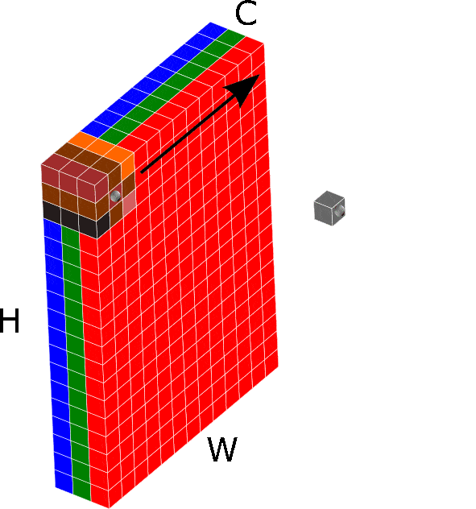

# Convolution Animations

Figures to explain how convolutional neural networks work.

```
  tf.keras.layers.Conv2D(
                        filters=2, 
                        kernel_size=(3,3), 
                        strides=(1, 1), 
                        padding='valid',
                        activation=None
)
```

+ `filters=2` Indicates you want 2 convolutional kernels/filters. This means the output will have 2 channels (regardless of how many channels in the input)
+ `kernel_size=(3,3)` Indiciates a 3x3 convolutional kernel/filter
+ `strides=(1,1)` Indicates the kernel should move 1 pixel at a time in the first and second axes
+ `padding='valid'` Indicates no padding of the input. The kernel/filter must completely cover a valid pixel.
+ `activation=None` Indicates no activation function after the convolution. Applied to every pixel in the output. (e.g. ReLU, tanh, Sigmoid)

### First convolutional layer:



### Second convolutional layer (note the kernel/filter is different):


